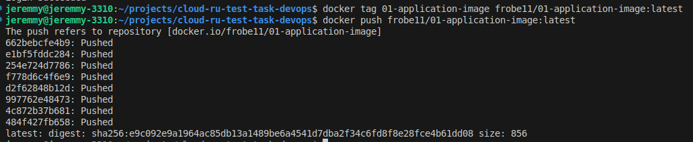

## команды, которые использовались для пуша образа в регистри
### создание docker-image 
```bash
docker build -t 01-application-image -f DockerFile .
```

### init password
без этого не получится использовать `docker login`
```bash
pass init <MY_SECRET_GPG_KEY_ID>
```

### залогиниться в docker hub 
```bash
docker login
```

### добавить тэг созданному образу
можно было заного сбилдить образ с новым тэгом, но тк у меня уже есть образ, я добавил ему новый тэг
```bash
docker tag 01-application-image frobe11/01-application-image:latest
```

### запушить образ в регистри
изменил default privacy на private

```bash
docker push frobe11/01-application-image:latest
```

