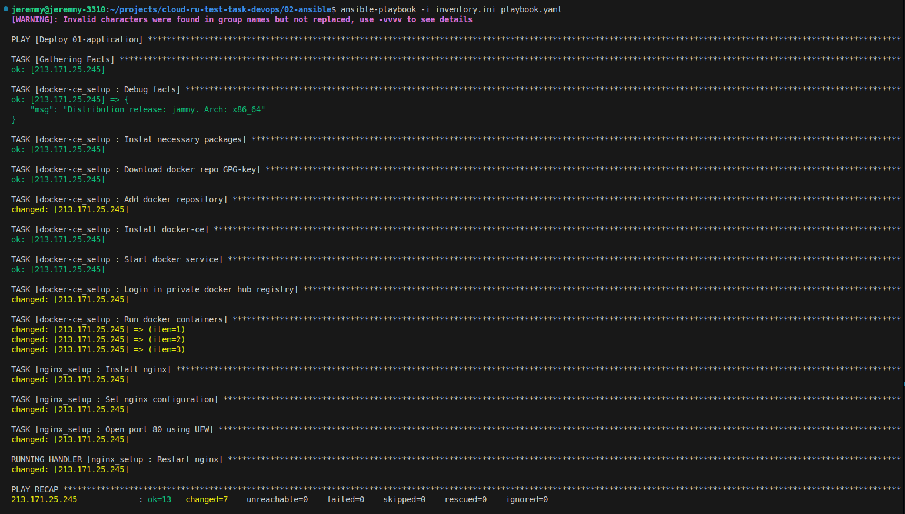

## Про выбор алгоритма балансировки
В нашём случае приложение на сервере stateless, сами сервера находятся в одной зоне доступности (одинаковая latency), имеют одинакуваю вычислительную мощьность.

Значит надо раскидывать соеденения по всем серверам равномерно => Алгоритм - round robin


## Ansible
решил написать 2 роли
1. docker-ce_setup
    - устанавливает docker-ce и запускает n контейнеров
    - переменные:
        - `docker_repo_key_path`        - путь до файла в котоый скачается ключ
        - `docker_user`                 - пользователь docker hub
        - `docker_pass`                 - пароль от docker hub
        - `docker_container_name`       - имя контейнера, который будет развёрнут 
        - `docker_image_name`           - полное имя нужного docker образа (с тэгом)
        - `docker_container_count`      - количество контейнеров которые нужно запустить
2. nginx_setup
    - запускает балансировщик nginx, добавляет config на основе template nginx.conf.j2
    - переменные:
        - `nginx_upstreams_server_count`- количество серверов, на которые nginx перенаправляет трафик

## Виртуальная машина
создал бесплатную виртуалку на cloud.ru с публичным ip адрессом, сгенерировал ssh ключ, закинул в виртуалку.

## inventory
да, я выложил inventory в открытый доступ, но ssh ключа кроме меня больше ни у кого нет, так что я не переживаю

## Запуск
```bash
ansible-playbook -i inventory.ini playbook.yaml
```


