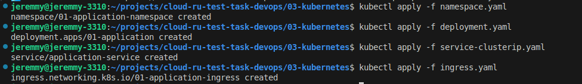
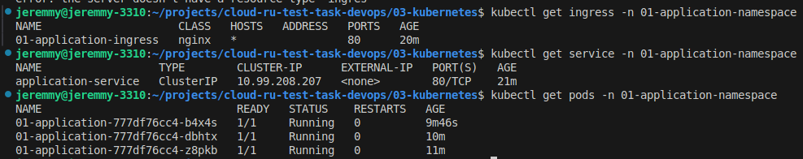
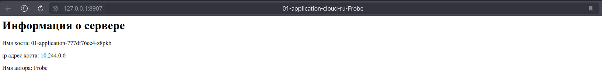

## Запустил minikube
```bash
minikube start
```
## Добавил secret для входа в docker hub
```bash
kubectl create secret docker-registry dockerhub \
  --docker-server=https://index.docker.io/v1/  \
  --docker-username=<LOGIN> \
  --docker-password=<PASS> \
  --docker-email=<EMAIL> \
  -n 01-application-namespace
```

## Apply manifests
```bash
kubectl apply -f namespace.yaml
kubectl apply -f deployment.yaml
kubectl apply -f service-clusterip.yaml
kubectl apply -f ingress.yaml
```


## Проверка состояния pods/ingress/svc
```bash
kubectl get ingress -n 01-application-namespace
kubectl get service -n 01-application-namespace
kubectl get pods -n 01-application-namespace
```

## Проброс портов
```bash
kubectl port-forward svc/application-service 8907:80 -n 01-application-namespace
```
