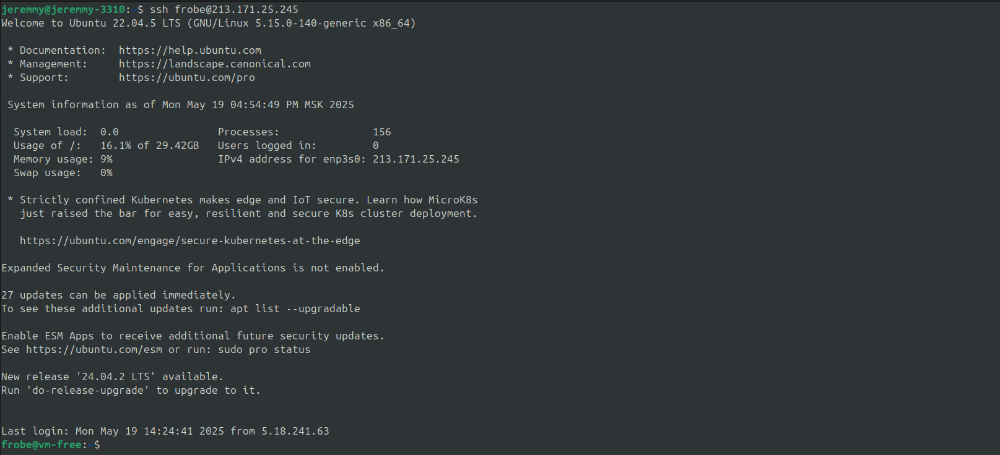

## Подключится к VM
```bash
ssh frobe@213.171.25.245
```


## Выполнить комманду `docker run -it --rm ubuntu bash`
```
sudo docker run -it --rm ubuntu bash
```


## apt update
```bash
apt update
apt install iptables sudo -y
``` 


## Попытаться заблокировать выход в сеть интернет
```bash
sudo iptables -A OUTPUT -j DROP
```


ах да, мы же в докер контейнере...

## Добавить несуществующий proxy
все запросы будут игнорироватся
```bash
echo "Acquire::http::Proxy "http://IDONTEXIST:PORT";" > /etc/apt/apt.conf.d/proxy.conf
```


## Альт способ:
### Откатить
```bash
rm /etc/apt/apt.conf.d/proxy.conf 
```


### Удалить ip корневого DNS сервера
нет корнегого DNS = domain names просто буквы
```bash
echo "nobody never been here" > /etc/resolv.conf
```
